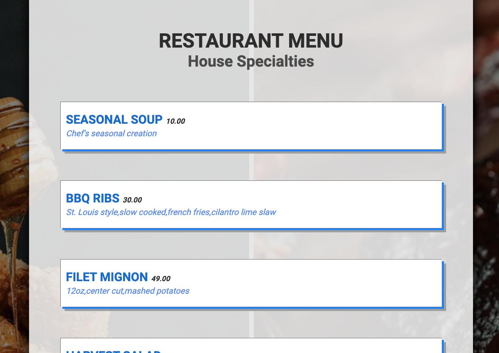

#Basic Restaurant Menu



##Docker
To run these apps you require docker, in root of repo run:

`$ docker-compose -f docker-compose.yml up`

docker-compose will create and start mongodb container and will also seed mongo.

##API
###Nest.js App

```
$ cd api
$ yarn install
$ yarn run start
```
Retrieve food items from mongodb.

`GET http://localhost:3000/food`

Retrieve beers from third-party API (brewerydb.com).

`GET http://localhost:3000/beer`


###API Tests
```
$ yarn run test:cov
yarn run v1.22.10
jest --coverage
 PASS  src/beers/beers.controller.spec.ts
 PASS  src/food/food.service.spec.ts
 PASS  src/food/food.controller.spec.ts
 PASS  src/beers/beers.service.spec.ts
----------------------|---------|----------|---------|---------|-------------------
File                  | % Stmts | % Branch | % Funcs | % Lines | Uncovered Line #s 
----------------------|---------|----------|---------|---------|-------------------
All files             |   90.48 |      100 |      60 |    87.5 |                   
 beers                |      75 |      100 |   33.33 |   66.67 |                   
  beers.controller.ts |    87.5 |      100 |      50 |   83.33 | 11                
  beers.service.ts    |    62.5 |      100 |      25 |      50 | 9-13              
 food                 |     100 |      100 |     100 |     100 |                   
  food.controller.ts  |     100 |      100 |     100 |     100 |                   
  food.entity.ts      |     100 |      100 |     100 |     100 |                   
  food.service.ts     |     100 |      100 |     100 |     100 |                   
----------------------|---------|----------|---------|---------|-------------------

Test Suites: 4 passed, 4 total
Tests:       6 passed, 6 total
Snapshots:   0 total
Time:        4.171 s, estimated 123 s
Ran all test suites.
✨  Done in 5.63s.

```

##Menu
### Next.js
```
$ cd menu
$ yarn install
$ yarn run dev
```
http://localhost:3001/

Food items are prefetched from API.

For drinks click on button `Click to See Latest Selection` which will fetch the drink data and set to state.
